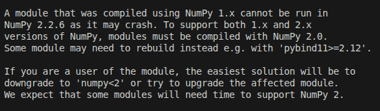

# Python_OpenCV

## Install Required Python Libraries
```bash
pip install -r requirement.txt
```

## NumPy Error

If while running your code, you get the following error:



Try upgrading your imported modules. For example, if you are importing `matplotlib`, upgrade using the following command:
```bash
pip install --upgrade matplotlib
```

## Important Concepts

### Image axis
1. **Origin (0,0):** The starting point is located at the top-left corner of the image.
2. **X-axis:** This axis runs horizontally from left to right. The x-coordinate represents the column number.
3. **Y-axis:** This axis runs vertically from top to bottom. The y-coordinate represents the row number.

